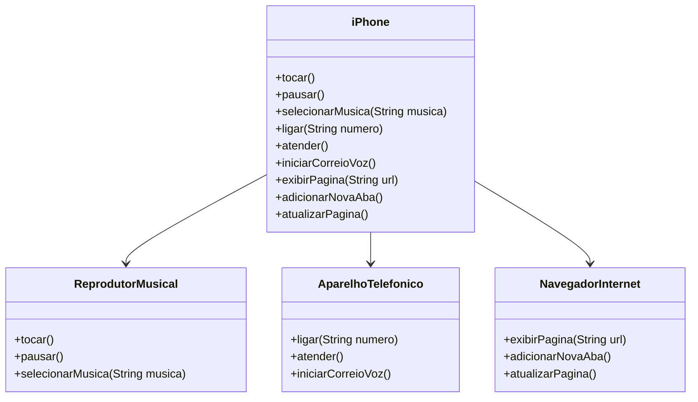

# 📱 Projeto iPhone

Este projeto simula as funcionalidades básicas de um iPhone utilizando Java e o conceito de Programação Orientada a Objetos (POO).

## ✨ Funcionalidades implementadas

- **Reprodutor Musical**
  - Tocar música
  - Selecionar música

- **Aparelho Telefônico**
  - Ligar para um número

- **Navegador de Internet**
  - Exibir uma página da web
  - Adicionar nova aba
  - Atualizar página

## 📊 Diagrama UML  

## 🧩 Estrutura do Projeto

O projeto está dividido em classes que representam cada funcionalidade:

- `iPhone.java`: Classe principal que implementa as interfaces dos módulos.
- `ReprodutorMusical.java`: Interface com métodos relacionados à música.
- `AparelhoTelefonico.java`: Interface com métodos para ligação.
- `NavegadorInternet.java`: Interface com métodos de navegação.
- `Main.java`: Classe com o método `main` que executa o programa.

## 💻 Exemplo de saída esperada

run:

Tocando música...

Selecionando música: Imagine - John Lennon

Ligando para: 11999998888

Exibindo página: https://google.com

BUILD SUCCESSFUL (total time: 0 seconds)

## 🚀 Como executar

1. Clone este repositório:
git clone https://github.com/AbN13/ProjetoIphone.git

2. Importe o projeto em uma IDE como o VScode, IntelliJ, Eclipse e/ou NetBeans.

3. Execute a classe `Main.java`.

## 🎥 Referência

Vídeo de lançamento do iPhone (Apple, 2007):
https://www.youtube.com/watch?v=9ou608QQRq8

Desenvolvido com 💻 por Abner Leandro Gonçalves.
